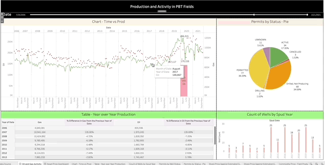
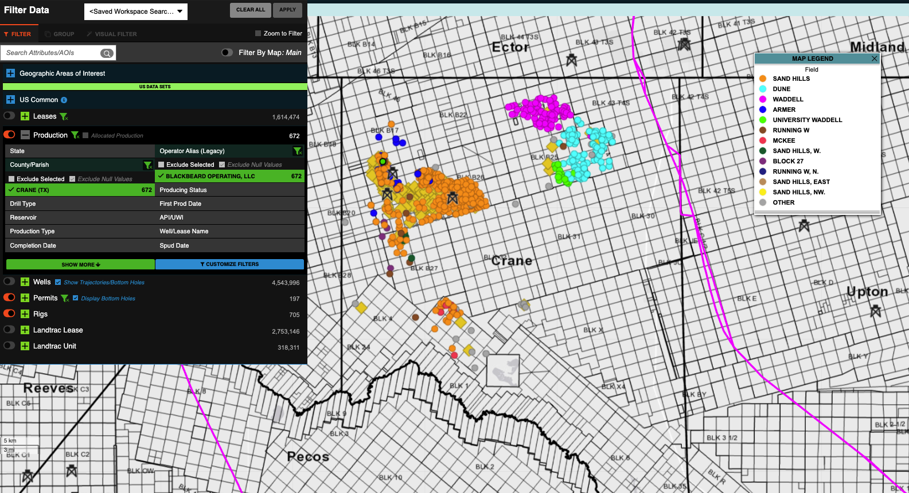
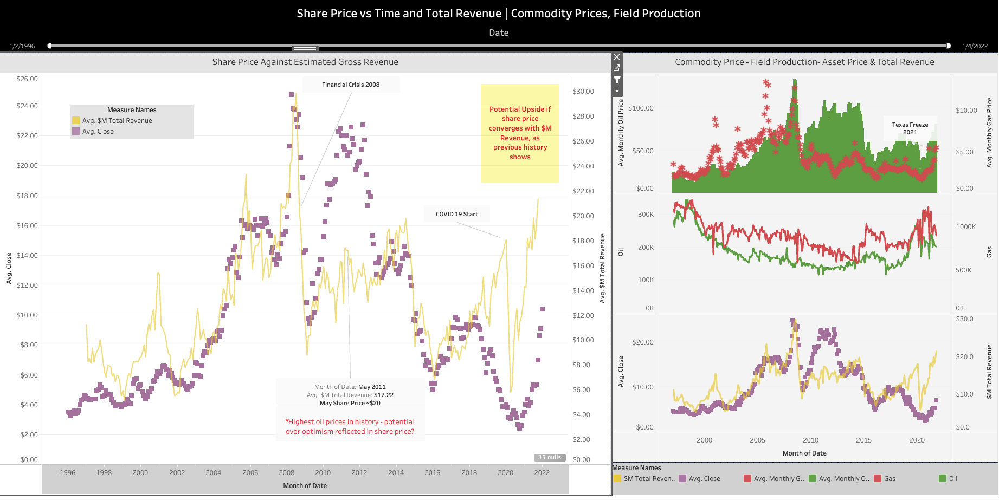
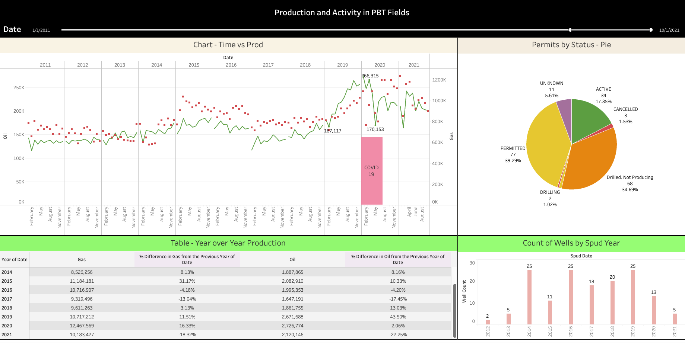

# Project Goal

1. Analyze PBT (Permian Basin Royalty Trust) asset price behavior and guide investment decisions for CEO
2. Answer ad-hoc questions about development in the area
<hr>

<h3 style='text-align:center'> Tableau Final Demo <br>Historical Asset Price vs Field Revenue | Oil & Gas Production and Activity</h3>



<hr>

## Method and Approach
* Use historical production and commodity prices to provide visual correlation against asset price to identify buy/sell points

## Code, Libraries, Softwares
1. Python 3.9
2. Pandas, Requests, Yfinance, Datetime, Seaborn
3. Jupyter Notebook, Tableau, Enverus O&G Data Library

## Data Sources | Ingestion and Transformation
### Ingestion
1. Enverus Data - Manual Download through Web App
    * Downloaded historical production, wells, and permit data within Blackbeard's operation (extent of PBT properties)


2. Yfinance - Fetch PBT historical asset/share price with pandas API 
3. EIA Web Site - Downloaded historical oil & gas prices by month & year

### Transformations
1. Column renaming for clarity on data fields
2. Joined historical oil and gas prices with historical field production on date field (month-yr format)
3. Created total revenue table using associated oil & gas price and monthly production for given month and year
4. Applied normalized scaling to all fields for share price correlation analysis
5. Created custom grouping of "Well Status" field in Permits data table to group alike values

* Code Snippet of grouping function
```python

def group_categories(value, similar_categories, target_category):
    '''
    similar_categories: list of values that wish to be grouped together
    target_category: value for similar values to be grouped to
    value: value in row of DataFrame
    '''
    if value in similar_categories:
        return target_category
    else:
        return value

vals_to_be_grouped = ['DUC', 'COMPLETED', 'INACTIVE', 'DRILLED']

permits['Well Status Grouped'] = permits['Well Status'].apply(lambda x: group_categories(x, vals_to_be_grouped, 'Drilled, Not Producing'))

```

# Tableau:
1. Connect Tableau to presentation data files to create dashboards.

<h3 style='text-align:center'> 1. Asset Price vs. Field Revenue</h3>




<h3 style='text-align:center'>2. Production and Permitting Activity</h3>


